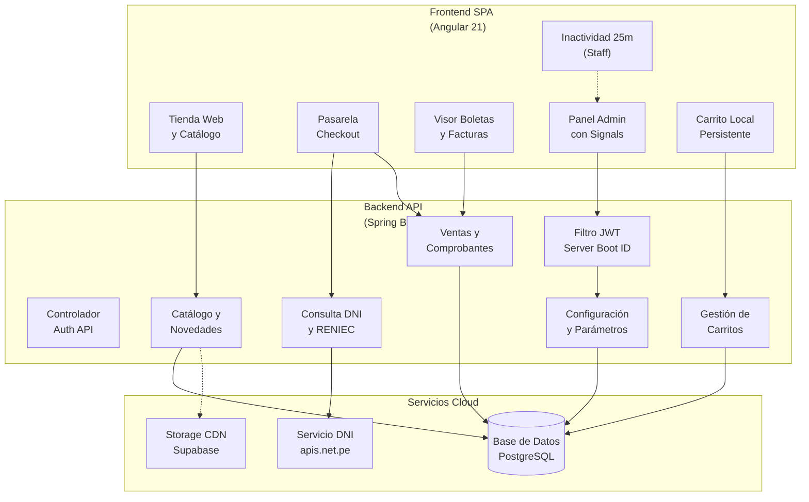
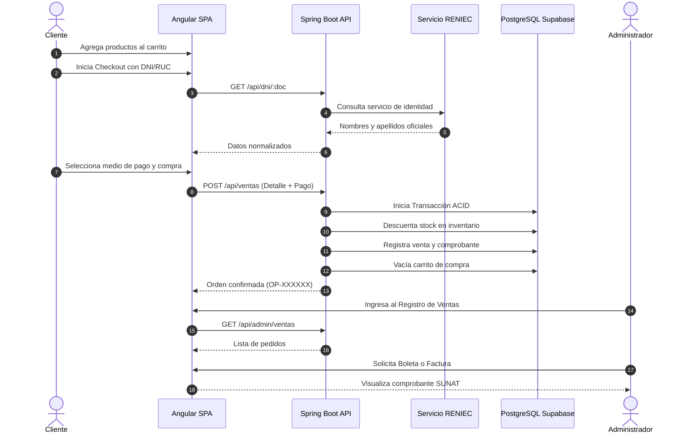
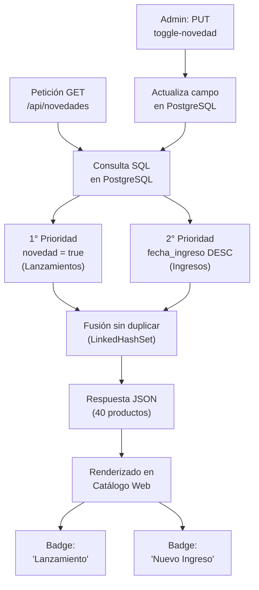
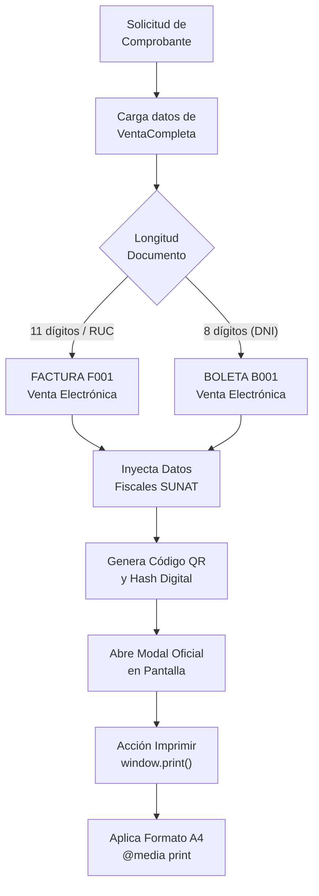
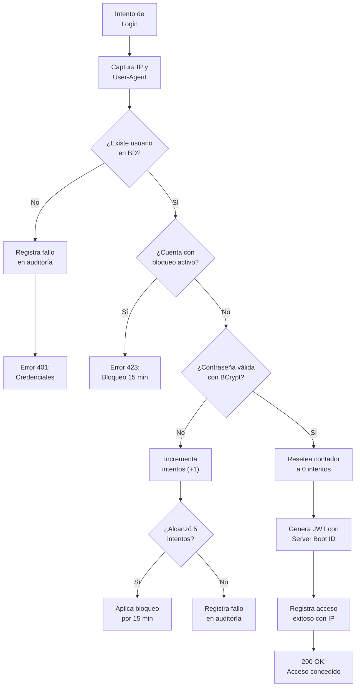
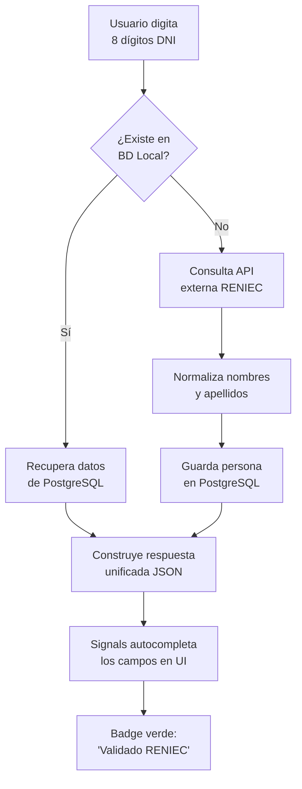
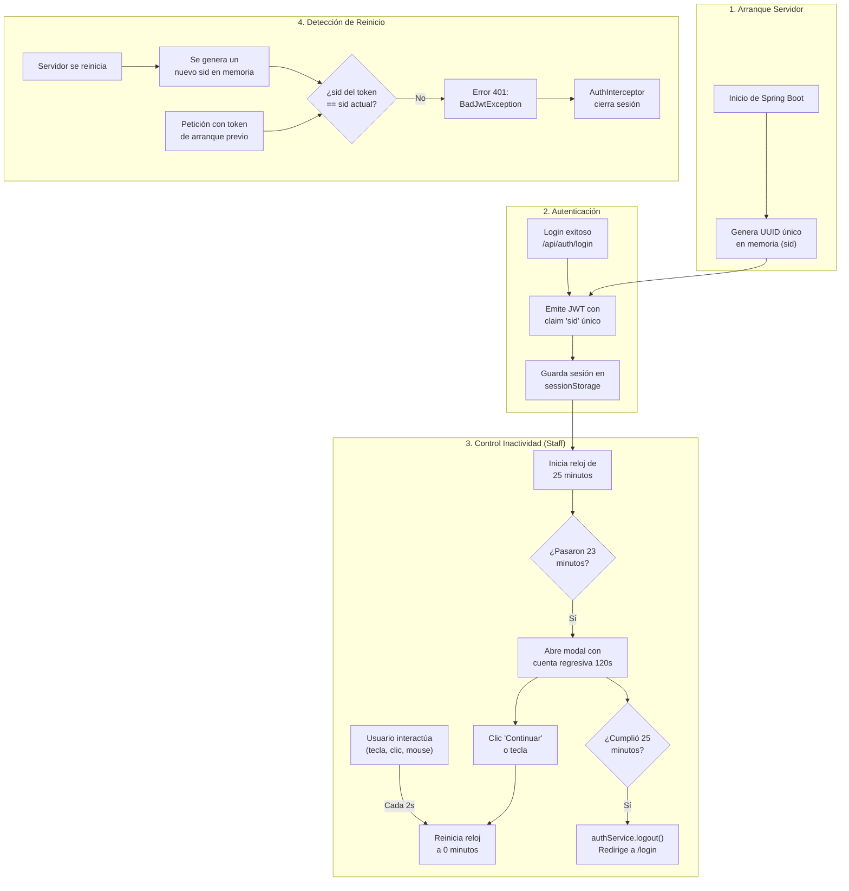
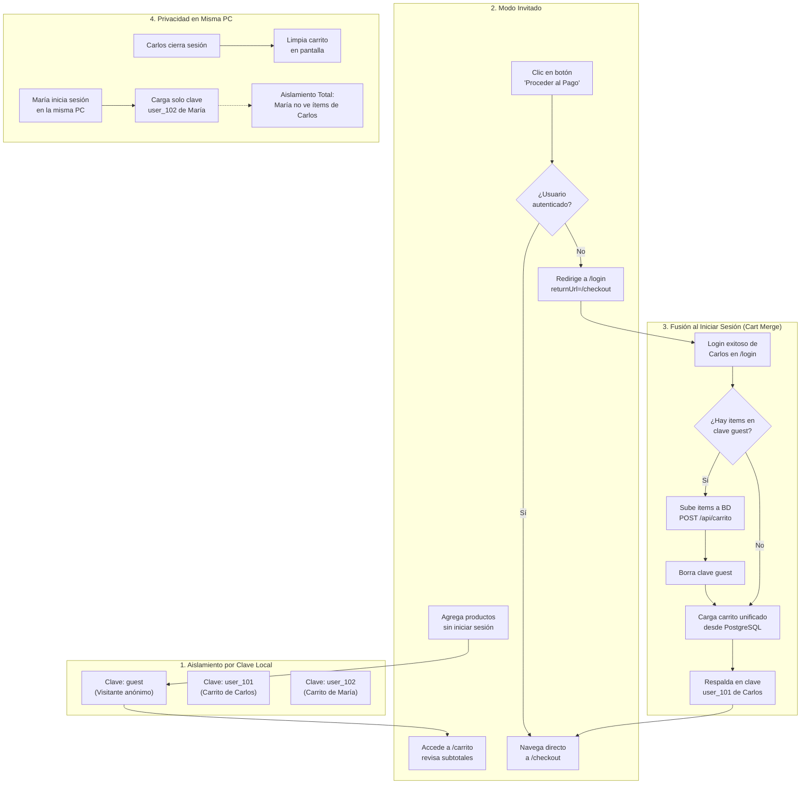
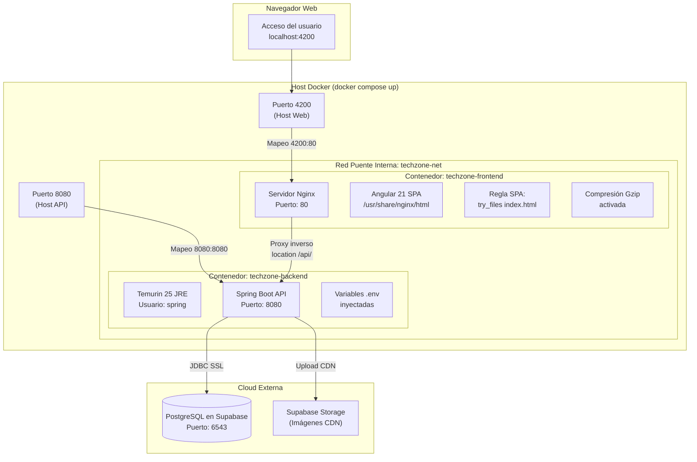

# Sistema de Gestión Integral TechZone · Avance III

**Curso:** Desarrollo Web Integrado  
**Ciclo Académico:** 2026-2 · Ciclo VIII  
**Repositorio Oficial:** [https://github.com/MrCarlos17A/TechZone.git](https://github.com/MrCarlos17A/TechZone.git)  
**Estado del Pipeline CI:** [](https://github.com/MrCarlos17A/TechZone/actions/workflows/ci.yml)  

---

## Integrantes del Proyecto

| N° | Apellidos y Nombres | Código Universitario |
| :---: | :--- | :---: |
| 1 | Arroyo Vega, Carlos Felipe | U23214686 |
| 2 | De La Cruz Becerra, Jesús Miguel | U22321531 |
| 3 | Ipanaque Bravo, Gabriel Arturo | U21209609 |
| 4 | Santamaria Damian, Jose Jhonatan | U23222412 |
| 5 | Suarez Paz, Jhon Antonio | U23257973 |
| 6 | Taboada Mimbela, Gabriela Alexandra | U23271730 |

---

## Descripción del Proyecto

TechZone es una plataforma web integral de comercio electrónico y gestión empresarial (ERP/E-Commerce B2C/B2B) orientada a la comercialización, distribución mayorista/minorista y control logístico de hardware gamer de alta gama (tarjetas gráficas serie RTX 50, monitores OLED/QHD de alta tasa de refresco, procesadores, periféricos y accesorios profesionales).

El proyecto está diseñado bajo una arquitectura desacoplada de dos capas (Monorepo Fullstack) con soporte integral para despliegue containerizado en Docker:
1. **Frontend SPA / SSR:** Interfaz moderna, reactiva y optimizada construida con Angular 21 (Server-Side Rendering), gestión de estado granular basada en Signals, maquetación profesional con Tailwind CSS, sistema de tokens de diseño en español (`:root` y `html.light`), soporte integral para Modo Claro / Modo Oscuro, validaciones de formularios en tiempo real con deshabilitación condicional de botones, matriz interactiva de autorización por módulo, carrito híbrido con persistencia local aislada por usuario, temporizador de inactividad de 25 minutos para personal administrativo y suite de pruebas unitarias con Vitest.
2. **Backend API REST:** Servidor robusto y escalable desarrollado en Java 25 con Spring Boot, arquitectura de seguridad basada en Spring Security con autenticación stateless mediante JWT y firma de ciclo de vida de instancia del servidor (Server Boot Signature), sistema dinámico de control de acceso por roles (RBAC) con permisos granulares por módulo, hashing de contraseñas con BCrypt, gestión de parámetros fiscales SUNAT, persistencia transaccional sobre PostgreSQL en Supabase, almacenamiento multimedia seguro en Supabase Storage y suite de pruebas unitarias con JUnit 5 y Mockito.
3. **Orquestación en Contenedores:** Configuración completa mediante Docker y Docker Compose para levantar frontend (Nginx) y backend (JVM Temurin) con un único comando sin requerir dependencias locales.

---

## Documentación Técnica Oficial para Sustentación

Para una comprensión exhaustiva de la arquitectura, flujos técnicos, código fuente y defensa oral del proyecto, se dispone de guías especializadas en el directorio [`documentacion/`](file:///d:/UTP/CICLO%20VIII/DESARROLLO%20WEB%20INTEGRADO/PROYECTO/AVANCE%20II/documentacion/):

| N° | Documento Oficial | Descripción Técnica |
| :---: | :--- | :--- |
| **00** | [00_INDICE_SUSTENTACION.md](file:///d:/UTP/CICLO%20VIII/DESARROLLO%20WEB%20INTEGRADO/PROYECTO/AVANCE%20II/documentacion/00_INDICE_SUSTENTACION.md) | Índice maestro, mapa conceptual, flujos y guía rápida de exposición. |
| **01** | [01_ARQUITECTURA_Y_DOCKER.md](file:///d:/UTP/CICLO%20VIII/DESARROLLO%20WEB%20INTEGRADO/PROYECTO/AVANCE%20II/documentacion/01_ARQUITECTURA_Y_DOCKER.md) | Arquitectura SPA, servidor Nginx (`try_files`), proxy inverso, Dockerfile y red interna. |
| **02** | [02_BACKEND_SPRING_BOOT.md](file:///d:/UTP/CICLO%20VIII/DESARROLLO%20WEB%20INTEGRADO/PROYECTO/AVANCE%20II/documentacion/02_BACKEND_SPRING_BOOT.md) | API REST en Java 25, 18 controladores, transacciones atómicas ACID y servicios. |
| **03** | [03_SEGURIDAD_JWT_Y_RBAC.md](file:///d:/UTP/CICLO%20VIII/DESARROLLO%20WEB%20INTEGRADO/PROYECTO/AVANCE%20II/documentacion/03_SEGURIDAD_JWT_Y_RBAC.md) | Seguridad defensiva, JWT con Server Boot Signature, matriz RBAC y bloqueo contra fuerza bruta. |
| **04** | [04_FRONTEND_ANGULAR_SSR.md](file:///d:/UTP/CICLO%20VIII/DESARROLLO%20WEB%20INTEGRADO/PROYECTO/AVANCE%20II/documentacion/04_FRONTEND_ANGULAR_SSR.md) | Angular 21, Signals, tokens de diseño en español, 18 gestores CRUD y modo oscuro. |
| **05** | [05_BASE_DE_DATOS_SUPABASE_POSTGRESQL.md](file:///d:/UTP/CICLO%20VIII/DESARROLLO%20WEB%20INTEGRADO/PROYECTO/AVANCE%20II/documentacion/05_BASE_DE_DATOS_SUPABASE_POSTGRESQL.md) | PostgreSQL en Supabase, Transaction Pooler (puerto 6543), HikariCP y esquema relacional. |
| **06** | [06_PREGUNTAS_Y_RESPUESTAS_SUSTENTACION.md](file:///d:/UTP/CICLO%20VIII/DESARROLLO%20WEB%20INTEGRADO/PROYECTO/AVANCE%20II/documentacion/06_PREGUNTAS_Y_RESPUESTAS_SUSTENTACION.md) | Banco de más de 30 preguntas y respuestas críticas para la defensa académica. |

---

## Estructura del Repositorio (Monorepo)

```text
TechZone/
├── documentacion/                              # Guías técnicas oficiales y manuales de sustentación
│   ├── 00_INDICE_SUSTENTACION.md               # Índice maestro y mapa conceptual de sustentación
│   ├── 01_ARQUITECTURA_Y_DOCKER.md             # Arquitectura fullstack, Docker, Nginx SPA y red
│   ├── 02_BACKEND_SPRING_BOOT.md               # API REST, controladores, servicios y transacciones
│   ├── 03_SEGURIDAD_JWT_Y_RBAC.md              # Seguridad defensiva, JWT con Boot ID y matriz RBAC
│   ├── 04_FRONTEND_ANGULAR_SSR.md              # Angular 21, Signals, tokens de diseño y 18 gestores
│   ├── 05_BASE_DE_DATOS_SUPABASE_POSTGRESQL.md # Conexión Supabase (puerto 6543), HikariCP y esquema
│   └── 06_PREGUNTAS_Y_RESPUESTAS_SUSTENTACION.md # Banco de preguntas y respuestas para la defensa
├── docker-compose.yml                          # Orquestación de contenedores (Frontend Nginx + Backend Spring Boot)
├── backend-techzone/                           # API REST - Spring Boot (Java 25)
│   ├── Dockerfile                              # Multi-stage build con Eclipse Temurin (JDK 25 compilador + JRE 25 ejecutor)
│   ├── .dockerignore                           # Exclusión de artefactos compilados, .env y temporales
│   ├── src/main/java/com/tienda/backend_techzone/
│   │   ├── Controller/api/                     # 18 Controladores REST con encabezados uniformes de gestores
│   │   ├── Model/                              # Entidades JPA (Persona, Usuario, Cliente, Empleado, Producto, Venta, Pago, etc.)
│   │   ├── Repository/                         # Acceso a datos Spring Data JPA y consultas especializadas
│   │   ├── Service/                            # Lógica de negocio, novedades híbridas, ventas, Supabase Storage y transacciones ACID
│   │   ├── Security/                           # Spring Security, filtros JWT con Server Boot ID, hashing BCrypt y control RBAC
│   │   └── BackendTechzoneApplication.java     # Clase principal de arranque de Spring Boot
│   ├── src/test/java/com/tienda/backend_techzone/
│   │   ├── Security/JwtServiceTest.java        # Pruebas unitarias de emisión, validación y expiración de tokens
│   │   └── Service/
│   │       ├── DniServiceTest.java             # Pruebas de consulta y normalización de identidad
│   │       ├── ProductoServiceTest.java        # Pruebas de catálogo, destacados y novedades
│   │       └── VentaServiceTest.java           # Pruebas de órdenes, totales, IGV y ciclo de estados
│   ├── src/main/resources/
│   │   └── application.properties              # Configuración de base de datos Supabase (puerto 6543), pool Hikari y JWT
│   ├── src/test/resources/
│   │   └── application.properties              # Configuración aislada con H2 en memoria para pruebas
│   ├── iniciar.ps1                             # Script de arranque automatizado local con detección de Java 25
│   ├── mvnw / mvnw.cmd                         # Maven Wrapper oficial
│   └── pom.xml                                 # Dependencias del proyecto (Spring Boot, JPA, JWT, Postgres)
│
├── frontend-techzone/                          # Cliente Web SPA - Angular 21
│   ├── Dockerfile                              # Multi-stage build con Node 22 (compilación) y Nginx Alpine (servidor web)
│   ├── nginx.conf                              # Configuración Nginx: SPA routing (try_files), compresión Gzip y proxy a /api/
│   ├── .dockerignore                           # Exclusión de node_modules, dist y temporales
│   ├── src/app/
│   │   ├── pages/                              # Vistas principales de la aplicación
│   │   │   ├── home/                           # Página principal y catálogo de destacados (9 ítems)
│   │   │   ├── novedades/                      # Módulo de novedades híbridas (lanzamientos y recientes)
│   │   │   ├── productos/                      # Catálogo interactivo con filtros (categoría, marca, precio)
│   │   │   ├── producto-detalle/               # Ficha técnica, galería de imágenes y compras directas
│   │   │   ├── carrito/                        # Carrito híbrido persistente con soporte para visitantes e inicio de pago
│   │   │   ├── checkout/                       # Pasarela de compra con validación DNI/RENIEC y selección de pago
│   │   │   ├── login/                          # Autenticación, redirección inteligente y control de expiración
│   │   │   ├── registro/                       # Alta de nuevos clientes con verificación de identidad
│   │   │   ├── perfil/                         # Gestión de datos personales del usuario autenticado
│   │   │   ├── mis-pedidos/                    # Historial de compras y visor de comprobantes oficiales SUNAT
│   │   │   └── admin/                          # Panel backoffice con 18 gestores CRUD, métricas y Signals
│   │   ├── components/                         # Componentes reutilizables de UI (Navbar, Footer, Tarjetas, Toasts)
│   │   ├── services/                           # Servicios HTTP reactivos y estado global con Signals
│   │   │   ├── auth.service.ts                 # Autenticación, sesión volátil en sessionStorage y handshake /me
│   │   │   ├── carrito.service.ts              # Carrito persistente con aislamiento estricto por usuario y fusión
│   │   │   ├── inactividad.service.ts          # Temporizador de 25 minutos para personal administrativo con aviso preventivo
│   │   │   ├── configuracion.service.ts        # Datos comerciales y parámetros tributarios SUNAT
│   │   │   └── ...                             # Servicios de productos, ventas, temas y notificaciones
│   │   ├── interceptors/                       # Interceptor HTTP con inyección Bearer y logout inmediato ante 401
│   │   └── models/                             # Interfaces TypeScript y tipado estricto del dominio
│   ├── src/app/pages/mis-pedidos/
│   │   └── mis-pedidos.component.spec.ts       # Pruebas unitarias de comprobantes electrónicos con Vitest
│   ├── src/styles.css                          # Tokens de diseño en español (:root, html.light) y reglas @media print
│   ├── package.json                            # Dependencias npm (Angular 21, Tailwind CSS, Vitest)
│   └── angular.json                            # Configuración de compilación de Angular
│
├── .github/                                    # Automatización CI/CD con GitHub Actions
│   └── workflows/ci.yml                        # Pipeline de integración continua (Spring Boot + Angular)
├── .gitignore                                  # Reglas maestras de exclusión (.env, target, dist, node_modules)
└── README.md                                   # Documentación técnica, diagramas de flujo y manual operativo
```

---

## Flujos y Arquitectura del Sistema

### 1. Arquitectura General y Comunicación entre Capas

**Descripción del Flujo:**  
TechZone implementa una arquitectura desacoplada en tres capas principales: la capa de presentación (Angular 21 SPA), la capa de servicios de negocio (Spring Boot REST API) y la capa de persistencia en la nube (PostgreSQL y Supabase Storage). El cliente gestiona el estado reactivo mediante Signals y se comunica exclusivamente vía JSON mediante peticiones HTTP asíncronas hacia el backend, el cual valida las credenciales y autorizaciones antes de interactuar con la base de datos relacional.


```mermaid
flowchart TD
    subgraph FRONTEND["Frontend SPA<br/>(Angular 21)"]
        UI_STORE["Tienda Web<br/>y Catálogo"]
        UI_CHECKOUT["Pasarela<br/>Checkout"]
        UI_VOUCHER["Visor Boletas<br/>y Facturas"]
        UI_ADMIN["Panel Admin<br/>con Signals"]
        CART_SVC["Carrito Local<br/>Persistente"]
        IDLE_SVC["Inactividad 25m<br/>(Staff)"]
    end

    subgraph BACKEND["Backend API<br/>(Spring Boot 4)"]
        GW["Filtro JWT<br/>Server Boot ID"]
        C_AUTH["Controlador<br/>Auth API"]
        C_DNI["Consulta DNI<br/>y RENIEC"]
        C_PROD["Catálogo y<br/>Novedades"]
        C_VENTA["Ventas y<br/>Comprobantes"]
        C_CART["Gestión de<br/>Carritos"]
        C_ADMIN["Configuración<br/>y Parámetros"]
    end

    subgraph CLOUD["Servicios Cloud"]
        SUPA_DB[("Base de Datos<br/>PostgreSQL")]
        SUPA_STORAGE["Storage CDN<br/>Supabase"]
        RENIEC["Servicio DNI<br/>apis.net.pe"]
    end

    UI_STORE --> C_PROD
    C_PROD --> SUPA_DB
    C_PROD -.-> SUPA_STORAGE

    CART_SVC --> C_CART
    C_CART --> SUPA_DB

    UI_CHECKOUT --> C_DNI
    C_DNI --> RENIEC

    UI_CHECKOUT --> C_VENTA
    C_VENTA --> SUPA_DB

    UI_VOUCHER --> C_VENTA
    UI_ADMIN --> GW
    GW --> C_ADMIN
    C_ADMIN --> SUPA_DB
    IDLE_SVC -.-> UI_ADMIN
```

**Guía de Componentes:**
* **Angular 21 SPA:** Interfaz de usuario que consume la API REST. Gestiona el enrutamiento del lado del cliente, almacenamiento en `sessionStorage` y persistencia local de carritos con `localStorage`.
* **Spring Boot API (Java 25):** Controlador central de lógica de negocio, validaciones transaccionales y emisión/verificación de tokens JWT firmados con HMAC-SHA256.
* **PostgreSQL (Supabase):** Almacén relacional transaccional (ACID) que custodia usuarios, productos, pedidos, pagos, parámetros fiscales y registros de auditoría.

---

### 2. Ciclo de Vida de una Venta, Pago y Despacho

**Descripción del Flujo:**  
Describe la secuencia completa desde que un cliente emite una compra en el Checkout hasta la verificación del pago y emisión del comprobante por el administrador. Todas las operaciones de descuento de inventario, registro de cabecera de venta, detalle y comprobante se ejecutan bajo una transacción atómica; si cualquier paso falla, se realiza un rollback automático.


```mermaid
sequenceDiagram
    autonumber
    actor Cliente as Cliente
    participant Front as Angular SPA
    participant Back as Spring Boot API
    participant RENIEC as Servicio RENIEC
    participant DB as PostgreSQL Supabase
    actor Admin as Administrador

    Cliente->>Front: Agrega productos al carrito
    Cliente->>Front: Inicia Checkout con DNI/RUC
    Front->>Back: GET /api/dni/:doc
    Back->>RENIEC: Consulta servicio de identidad
    RENIEC-->>Back: Nombres y apellidos oficiales
    Back-->>Front: Datos normalizados
    Cliente->>Front: Selecciona medio de pago y compra
    Front->>Back: POST /api/ventas (Detalle + Pago)
    Back->>DB: Inicia Transacción ACID
    Back->>DB: Descuenta stock en inventario
    Back->>DB: Registra venta y comprobante
    Back->>DB: Vacía carrito de compra
    Back-->>Front: Orden confirmada (OP-XXXXXX)
    Admin->>Front: Ingresa al Registro de Ventas
    Front->>Back: GET /api/admin/ventas
    Back-->>Front: Lista de pedidos
    Admin->>Front: Solicita Boleta o Factura
    Front-->>Admin: Visualiza comprobante SUNAT
```

**Etapas del Ciclo Logístico:**
1. **Validación de Identidad:** Verificación de DNI en RENIEC para evitar fraudes en comprobantes.
2. **Transacción ACID:** Bloqueo y descuento de stock en almacén; inserción simultánea en tablas `venta`, `detalle_venta` y `pago`.
3. **Control Operativo:** El personal administrativo inspecciona la transacción y actualiza el estado logístico (`PREPARACION` -> `CAMINO` -> `ENTREGADO`).

---

### 3. Lógica del Algoritmo de Novedades Híbridas

**Descripción del Flujo:**  
Para la sección de Novedades (`/novedades`), el sistema combina el criterio editorial manual con la llegada automática de mercadería reciente a los almacenes de TechZone. Esto garantiza que los lanzamientos promocionales tengan visibilidad prioritaria sin descuidar los últimos ingresos físicos.


```mermaid
flowchart TD
    REQ["Petición GET<br/>/api/novedades"] --> DB_QUERY["Consulta SQL<br/>en PostgreSQL"]
    
    DB_QUERY --> P1["1° Prioridad<br/>novedad = true<br/>(Lanzamientos)"]
    DB_QUERY --> P2["2° Prioridad<br/>fecha_ingreso DESC<br/>(Ingresos)"]
    
    P1 --> FUSION["Fusión sin duplicar<br/>(LinkedHashSet)"]
    P2 --> FUSION
    
    FUSION --> RESPONSE["Respuesta JSON<br/>(40 productos)"]
    RESPONSE --> RENDER["Renderizado en<br/>Catálogo Web"]
    
    RENDER --> BADGE1["Badge:<br/>'Lanzamiento'"]
    RENDER --> BADGE2["Badge:<br/>'Nuevo Ingreso'"]
    
    ADMIN_TOGGLE["Admin: PUT<br/>toggle-novedad"] --> UPDATE_BD["Actualiza campo<br/>en PostgreSQL"]
    UPDATE_BD --> DB_QUERY
```

**Reglas de Ordenamiento:**
* **Prioridad 1 (Editorial):** Productos marcados con `novedad = true` por el administrador aparecen primero con el badge *"Lanzamiento"*.
* **Prioridad 2 (Cronológica):** Productos ordenados por `fecha_ingreso DESC` complementan la lista con el badge *"Nuevo Ingreso"*.
* **Garantía de Unicidad:** `LinkedHashSet` en la capa de servicios de Spring Boot evita que un producto aparezca duplicado si coincide en ambas condiciones.

---

### 4. Ciclo de Facturación Electrónica y Representación Impresa (SUNAT)

**Descripción del Flujo:**  
Generación de la representación impresa del comprobante tributario conforme a la normativa SUNAT. El sistema clasifica automáticamente el tipo de documento según la longitud y naturaleza del documento del titular, ensamblando los parámetros fiscales registrados en la configuración de la empresa.


```mermaid
flowchart TD
    REQ["Solicitud de<br/>Comprobante"] --> LOAD["Carga datos de<br/>VentaCompleta"]
    
    LOAD --> EVAL{"Longitud<br/>Documento"}
    EVAL -- "11 dígitos / RUC" --> FACTURA["FACTURA F001<br/>Venta Electrónica"]
    EVAL -- "8 dígitos (DNI)" --> BOLETA["BOLETA B001<br/>Venta Electrónica"]
    
    FACTURA --> PARAMS["Inyecta Datos<br/>Fiscales SUNAT"]
    BOLETA --> PARAMS
    
    PARAMS --> HASH["Genera Código QR<br/>y Hash Digital"]
    HASH --> MODAL["Abre Modal Oficial<br/>en Pantalla"]
    MODAL --> PRINT["Acción Imprimir<br/>window.print()"]
    PRINT --> CSS_PRINT["Aplica Formato A4<br/>@media print"]
```

**Parámetros Fiscales Inyectados:**
* **Emisor:** R.U.C. 20608945123 · TECHZONE GAMING STORE S.A.C.
* **Sede Fiscal:** Av. Javier Prado Este 4200, Santiago de Surco - Lima.
* **Desglose Tributario:** Operación Gravada + I.G.V. (18.00%) = Importe Total.
* **Resolución SUNAT:** Autorizado mediante resolución de intendencia SUNAT para emisión electrónica.

---

### 5. Seguridad Defensiva, Bloqueo de Intentos y Auditoría IP

**Descripción del Flujo:**  
Mecanismo de protección contra ataques de fuerza bruta y accesos no autorizados. Cada intento de inicio de sesión registra la dirección IP y el navegador del cliente en la bitácora forense de la base de datos. Si se detectan 5 intentos consecutivos fallidos sobre una misma cuenta, se activa un bloqueo automático por 15 minutos.


```mermaid
flowchart TD
    START["Intento de<br/>Login"] --> CAPTURE["Captura IP y<br/>User-Agent"]
    CAPTURE --> FIND{"¿Existe usuario<br/>en BD?"}
    
    FIND -- No --> AUDIT_FAIL1["Registra fallo<br/>en auditoría"] --> RET_401["Error 401:<br/>Credenciales"]
    
    FIND -- Sí --> LOCKED{"¿Cuenta con<br/>bloqueo activo?"}
    LOCKED -- Sí --> RET_423["Error 423:<br/>Bloqueo 15 min"]
    
    LOCKED -- No --> CHECK_PASS{"¿Contraseña válida<br/>con BCrypt?"}
    CHECK_PASS -- No --> INC["Incrementa<br/>intentos (+1)"]
    INC --> MAX{"¿Alcanzó 5<br/>intentos?"}
    MAX -- Sí --> SET_LOCK["Aplica bloqueo<br/>por 15 min"]
    MAX -- No --> AUDIT_FAIL2["Registra fallo<br/>en auditoría"]
    
    CHECK_PASS -- Sí --> RESET_COUNT["Resetea contador<br/>a 0 intentos"]
    RESET_COUNT --> GEN_TOKEN["Genera JWT con<br/>Server Boot ID"]
    GEN_TOKEN --> AUDIT_OK["Registra acceso<br/>exitoso con IP"]
    AUDIT_OK --> RET_200["200 OK:<br/>Acceso concedido"]
```

**Tabla de Políticas de Control de Acceso:**
* **Límite de Intentos:** 5 intentos erróneos consecutivos.
* **Tiempo de Bloqueo:** 15 minutos de espera obligatoria antes de permitir un nuevo intento.
* **Trazabilidad:** Cada evento (éxito o fallo) se almacena en la tabla `registro_accesos` con marca de tiempo e IP.

---

### 6. Integración y Validación de Identidad (API DNI y RENIEC)

**Descripción del Flujo:**  
Flujo de validación en tiempo real para agilizar el llenado de formularios y asegurar que los comprobantes tributarios se emitan a nombre de ciudadanos reales. El sistema implementa una caché local en PostgreSQL para consultas repetidas y recurre al servicio externo de RENIEC ante documentos no registrados previamente.


```mermaid
flowchart TD
    INPUT["Usuario digita<br/>8 dígitos DNI"] --> CHECK_CACHE{"¿Existe en<br/>BD Local?"}
    
    CHECK_CACHE -- Sí --> FROM_DB["Recupera datos<br/>de PostgreSQL"]
    CHECK_CACHE -- No --> CALL_RENIEC["Consulta API<br/>externa RENIEC"]
    
    CALL_RENIEC --> NORMALIZE["Normaliza nombres<br/>y apellidos"]
    NORMALIZE --> SAVE_CACHE["Guarda persona<br/>en PostgreSQL"]
    
    FROM_DB --> DTO["Construye respuesta<br/>unificada JSON"]
    SAVE_CACHE --> DTO
    
    DTO --> AUTOFILL["Signals autocompleta<br/>los campos en UI"]
    AUTOFILL --> BADGE["Badge verde:<br/>'Validado RENIEC'"]
```

**Puntos de Integración:**
1. Formulario de Registro de Nuevos Clientes (`/registro`).
2. Pasarela de Checkout de Compras (`/checkout`).
3. Formulario de Mi Perfil (`/perfil`).
4. Módulo de Alta de Colaboradores en Backoffice (`/admin`).

---

### 7. Ciclo de Vida de Sesión, Inactividad de 25 Minutos y Firma de Instancia

**Descripción del Flujo:**  
Protección de sesiones ante dos riesgos críticos: abandono del equipo en el panel administrativo y persistencia indebida de sesiones tras apagados del servidor. Implementa un identificador único de instancia en memoria (`INSTANCIA_SERVIDOR_ID`), almacenamiento volátil en `sessionStorage` y un temporizador pasivo de inactividad de 25 minutos para personal administrativo con modal de aviso preventivo.


```mermaid
flowchart TD
    subgraph BOOT["1. Arranque Servidor"]
        INIT_SRV["Inicio de Spring Boot"] --> GEN_SID["Genera UUID único<br/>en memoria (sid)"]
    end

    subgraph SESSION["2. Autenticación"]
        LOGIN_OK["Login exitoso<br/>/api/auth/login"] --> EMIT_JWT["Emite JWT con<br/>claim 'sid' único"]
        EMIT_JWT --> SAVE_SESS["Guarda sesión en<br/>sessionStorage"]
    end

    subgraph INACTIVITY["3. Control Inactividad (Staff)"]
        START_TIMER["Inicia reloj de<br/>25 minutos"]
        USER_ACTION["Usuario interactúa<br/>(tecla, clic, mouse)"] -->|Cada 2s| RESET_TIMER["Reinicia reloj<br/>a 0 minutos"]
        
        START_TIMER --> CHECK_23{"¿Pasaron 23<br/>minutos?"}
        CHECK_23 -- Sí --> SHOW_MODAL["Abre modal con<br/>cuenta regresiva 120s"]
        
        SHOW_MODAL --> BTN_CONT["Clic 'Continuar'<br/>o tecla"] --> RESET_TIMER
        SHOW_MODAL --> TIMEOUT_25{"¿Cumplió 25<br/>minutos?"}
        TIMEOUT_25 -- Sí --> LOGOUT_IDLE["authService.logout()<br/>Redirige a /login"]
    end

    subgraph RESTART_CHECK["4. Detección de Reinicio"]
        RESTART_SRV["Servidor se reinicia"] --> NEW_SID["Se genera un<br/>nuevo sid en memoria"]
        REQ_OLD["Petición con token<br/>de arranque previo"]
        NEW_SID --> VALIDATE_SID{"¿sid del token<br/>== sid actual?"}
        REQ_OLD --> VALIDATE_SID
        VALIDATE_SID -- No --> REJECT_401["Error 401:<br/>BadJwtException"]
        REJECT_401 --> AUTO_LOGOUT["AuthInterceptor<br/>cierra sesión"]
    end

    GEN_SID --> EMIT_JWT
    SAVE_SESS --> START_TIMER
```

**Detalle de Políticas de Sesión:**
* **Server Boot Signature:** Cada vez que el backend arranca, se genera un UUID único en memoria. Si el servidor se apaga o reinicia, cualquier token emitido en una sesión previa es rechazado automáticamente con `401 Unauthorized`.
* **Almacenamiento Volátil (`sessionStorage`):** Al cerrar la pestaña o el navegador, la sesión se destruye por completo por el propio navegador, protegiendo al usuario si abandona el equipo.
* **Temporizador de 25 Minutos (Staff):** Monitorea pasivamente el uso de periféricos. Al minuto 23 muestra un modal preventivo con cuenta regresiva de 120 segundos; si no hay respuesta al minuto 25, cierra la sesión. Los clientes de la tienda mantienen su sesión continua de 8 horas para no interrumpir compras.

---

### 8. Arquitectura del Carrito Híbrido Persistente y Aislamiento por Usuario

**Descripción del Flujo:**  
Garantiza que ningún cliente pierda sus productos seleccionados si cierra sesión, se le apaga el servidor o abandona temporalmente la página, manteniendo al mismo tiempo un **aislamiento absoluto e independiente entre diferentes usuarios** en una misma computadora compartida.


```mermaid
flowchart TD
    subgraph NAMESPACING["1. Aislamiento por Clave Local"]
        GUEST_KEY["Clave: guest<br/>(Visitante anónimo)"]
        USER_A_KEY["Clave: user_101<br/>(Carrito de Carlos)"]
        USER_B_KEY["Clave: user_102<br/>(Carrito de María)"]
    end

    subgraph GUEST_NAV["2. Modo Invitado"]
        ADD_PROD["Agrega productos<br/>sin iniciar sesión"] --> GUEST_KEY
        VIEW_CART["Accede a /carrito<br/>revisa subtotales"]
        GUEST_KEY --> VIEW_CART
        
        GO_PAY["Clic en botón<br/>'Proceder al Pago'"]
        GO_PAY --> IS_AUTH{"¿Usuario<br/>autenticado?"}
        IS_AUTH -- No --> REDIR_LOGIN["Redirige a /login<br/>returnUrl=/checkout"]
        IS_AUTH -- Sí --> GOTO_PAY["Navega directo<br/>a /checkout"]
    end

    subgraph MERGE_FLOW["3. Fusión al Iniciar Sesión (Cart Merge)"]
        REDIR_LOGIN --> LOGIN_SUCCESS["Login exitoso de<br/>Carlos en /login"]
        LOGIN_SUCCESS --> HAS_GUEST{"¿Hay items en<br/>clave guest?"}
        
        HAS_GUEST -- Sí --> UPLOAD_GUEST["Sube items a BD<br/>POST /api/carrito"]
        UPLOAD_GUEST --> DEL_GUEST["Borra clave guest"]
        DEL_GUEST --> FETCH_DB["Carga carrito unificado<br/>desde PostgreSQL"]
        HAS_GUEST -- No --> FETCH_DB
        
        FETCH_DB --> BACKUP_USER["Respalda en clave<br/>user_101 de Carlos"]
        BACKUP_USER --> GOTO_PAY
    end

    subgraph ISOLATION_FLOW["4. Privacidad en Misma PC"]
        CARLOS_LOGOUT["Carlos cierra sesión"] --> CLEAR_VIEW["Limpia carrito<br/>en pantalla"]
        MARIA_LOGIN["María inicia sesión<br/>en la misma PC"] --> LOAD_MARIA["Carga solo clave<br/>user_102 de María"]
        LOAD_MARIA -.-> SHIELD["Aislamiento Total:<br/>María no ve ítems de Carlos"]
    end
```

**Reglas del Carrito Híbrido:**
* **Aislamiento por Prefijo (*Namespacing*):** Cada usuario registrado almacena sus datos en `techzone_cart_user_{idUsuario}`. Si dos personas distintas inician sesión en la misma máquina, sus carritos nunca se cruzan.
* **Fusión Inteligente (*Cart Merge*):** Los productos agregados como invitado se transfieren automáticamente a la cuenta del usuario al autenticarse, eliminando la clave temporal de invitado.
* **Regla de Limpieza:** El carrito nunca se vacía por cerrar sesión o expirar el token. Solo se vacía cuando el usuario pulsa *"Vaciar Carrito"* o cuando la compra se concreta con éxito en el Checkout.

---

### 9. Arquitectura de Containerización con Docker Compose y Nginx

**Descripción del Flujo:**  
Estructura de despliegue contenerizado que permite levantar la plataforma completa con un único comando. El frontend se empaqueta en una imagen de Nginx Alpine optimizada con soporte para enrutamiento SPA y compresión Gzip, mientras que el backend corre sobre una máquina virtual Java 25 de Eclipse Temurin ejecutada con un usuario de sistema sin privilegios.


```mermaid
flowchart TD
    subgraph DOCKER_ENGINE["Host Docker (docker compose up)"]
        subgraph BRIDGE_NET["Red Puente Interna: techzone-net"]
            
            subgraph FRONTEND_CONTAINER["Contenedor: techzone-frontend"]
                NGINX_SRV["Servidor Nginx<br/>Puerto: 80"]
                WEB_ASSETS["Angular 21 SPA<br/>/usr/share/nginx/html"]
                SPA_RULE["Regla SPA:<br/>try_files index.html"]
                GZIP_COMP["Compresión Gzip<br/>activada"]
            end

            subgraph BACKEND_CONTAINER["Contenedor: techzone-backend"]
                TEMURIN_JVM["Temurin 25 JRE<br/>Usuario: spring"]
                SPRING_APP["Spring Boot API<br/>Puerto: 8080"]
                ENV_INJECT["Variables .env<br/>inyectadas"]
            end
        end

        HOST_4200["Puerto 4200<br/>(Host Web)"] -->|Mapeo 4200:80| NGINX_SRV
        HOST_8080["Puerto 8080<br/>(Host API)"] -->|Mapeo 8080:8080| SPRING_APP
        
        NGINX_SRV -->|Proxy inverso<br/>location /api/| SPRING_APP
    end

    subgraph CLIENT["Navegador Web"]
        USER_PC["Acceso del usuario<br/>localhost:4200"]
    end

    subgraph CLOUD_SERVICES["Cloud Externa"]
        SUPABASE_PG[("PostgreSQL en Supabase<br/>Puerto: 6543")]
        SUPABASE_BUCKET["Supabase Storage<br/>(Imágenes CDN)"]
    end

    USER_PC --> HOST_4200
    SPRING_APP -->|JDBC SSL| SUPABASE_PG
    SPRING_APP -->|Upload CDN| SUPABASE_BUCKET
```

**Detalle de la Red y Contenedores:**
* **`techzone-frontend`:** Construido en multi-stage con Node 22 (etapa builder) y Nginx Alpine (etapa runner). Expone el puerto `80` mapeado al puerto `4200` del host. Cuenta con proxy inverso configurado en `/api/` hacia `http://backend:8080/api/`.
* **`techzone-backend`:** Construido en multi-stage con Eclipse Temurin JDK 25 (etapa builder) y JRE 25 (etapa runner). Ejecuta bajo el usuario `spring:spring` (UID 1001) para máxima seguridad. Expone el puerto `8080`.
* **`techzone-net`:** Red tipo bridge que comunica ambos contenedores internamente mediante resolución de nombres DNS de Docker.

---

## Sistema Dinámico de Roles y Control de Acceso Granular (RBAC)

TechZone cuenta con un sistema de autorización granular dinámico basado en dos niveles de evaluación:
1. **Acceso al Entorno Administrativo (`esAdministrativo` / `es_administrativo`):** Define si un rol tiene autorización para iniciar sesión o navegar en el backoffice (`/admin`). De los 7 roles del sistema, **únicamente 5 roles tienen acceso al panel administrativo**, mientras que los roles de cliente y usuario final quedan confinados a la tienda pública.
2. **Matriz de Autorización por Módulo (JSON):** Cada rol administrativo define un esquema de operaciones permitidas (`ver`, `crear`, `editar`, `eliminar`) sobre los módulos funcionales del sistema.

### Catálogo Oficial de Roles del Sistema

| ID Rol | Nombre del Rol | Acceso a `/admin` | Estado | Perfil Operativo y Alcance de Módulos |
| :---: | :--- | :---: | :---: | :--- |
| **#1** | **Administrador** | **SÍ** | **ACTIVO** | Acceso total e irrestricto a todos los módulos: Dashboard, Catálogo, Personas, Ventas, Carrito, Configuración, Roles, Documentos, Ubigeos y Auditoría. |
| **#2** | **Trabajador** | **SÍ** | **ACTIVO** | Operación diaria de tienda: Dashboard, Productos, Categorías, Marcas, Imágenes, Ventas, Pagos, Clientes y Centro de Ayuda. **Módulos restringidos y ocultos:** Usuarios, Colaboradores, Proveedores, Medios de Pago, Carritos, Configuración del Sitio, Roles, Tipos de Documento, Ubigeos y Auditoría. |
| **#3** | **Usuario** | **NO** | **ACTIVO** | Usuario registrado estándar de la plataforma web sin privilegios de gestión. |
| **#4** | **Cliente** | **NO** | **ACTIVO** | Comprador de la tienda online con acceso a su perfil, carrito híbrido e historial de pedidos. |
| **#5** | **Supervisor de Ventas** | **SÍ** | **ACTIVO** | Gestión comercial: Dashboard, Ventas, Pagos, Clientes y consulta de Productos. |
| **#6** | **Logística y Almacén** | **SÍ** | **ACTIVO** | Control logístico: Dashboard, Productos, Categorías, Marcas, Galería de Imágenes y seguimiento de Ventas. |
| **#7** | **Soporte Técnico** | **SÍ** | **ACTIVO** | Asistencia técnica y auditoría: Dashboard, Usuarios, Clientes, Productos, Ventas y Auditoría de accesos. |

---

## Matriz de Navegación Visual en Barra Lateral (Trabajador vs Administrador)

| Categoría | Módulo | Administrador (#1) | Trabajador (#2) | Acción ante Acceso Directo por URL |
| :--- | :--- | :---: | :---: | :--- |
| **Principal** | Dashboard General | Visible | Visible | Permitido (`dashboard:ver`) |
| **Catálogo** | Productos | Visible | Visible | Permitido (`productos:ver,crear,editar`) |
| **Catálogo** | Categorías | Visible | Visible | Permitido (`categorias:ver`) |
| **Catálogo** | Marcas | Visible | Visible | Permitido (`marcas:ver`) |
| **Catálogo** | Galería de Imágenes | Visible | Visible | Permitido (`imagenes:ver`) |
| **Catálogo** | Producto - Proveedor | Visible | **Oculto** | Toast de restricción y bloqueo |
| **Personas** | Personas | Visible | **Oculto** | Toast de restricción y bloqueo |
| **Personas** | Clientes | Visible | Visible | Permitido (`clientes:ver,crear,editar`) |
| **Personas** | Colaboradores (Nómina) | Visible | **Oculto** | Toast de restricción y bloqueo |
| **Personas** | Proveedores | Visible | **Oculto** | Toast de restricción y bloqueo |
| **Personas** | Usuarios del Sistema | Visible | **Oculto** | Toast de restricción y bloqueo |
| **Ventas** | Registro de Ventas | Visible | Visible | Permitido (`ventas:ver,crear,editar`) |
| **Ventas** | Detalle de Venta | Visible | **Oculto** | Toast de restricción y bloqueo |
| **Ventas** | Pagos y Pasarelas | Visible | Visible | Permitido (`pagos:ver`) |
| **Ventas** | Medios de Pago | Visible | **Oculto** | Toast de restricción y bloqueo |
| **Carrito** | Carritos Activos | Visible | **Oculto** | Bloque completo de Carrito oculto |
| **Carrito** | Detalle de Carrito | Visible | **Oculto** | Bloque completo de Carrito oculto |
| **Configuración** | Configuración Sitio Web | Visible | **Oculto** | Bloque completo de Configuración oculto |
| **Configuración** | Roles y Permisos | Visible | **Oculto** | Bloque completo de Configuración oculto |
| **Configuración** | Tipos de Documento | Visible | **Oculto** | Bloque completo de Configuración oculto |
| **Configuración** | Ubigeos | Visible | **Oculto** | Bloque completo de Configuración oculto |
| **Configuración** | Auditoría y Trazabilidad | Visible | **Oculto** | Bloque completo de Configuración oculto |
| **Ayuda** | Centro de Ayuda & Manual | Visible | Visible | Acceso libre a guías interactivas |

---

## Catálogo de los 18 Gestores CRUD del Backoffice Administrativo

El panel administrativo de TechZone (`/admin`) integra **18 gestores CRUD completos** agrupados en 6 módulos funcionales. Para facilitar la identificación rápida y sustentación de cada operación sin distracciones ni dudas, **cada gestor cuenta con un encabezado prominente y uniforme en el código fuente** (tanto en los controladores Java como en la plantilla Angular):

```text
// ==============================================================
// CRUD DE GESTOR [NOMBRE DEL GESTOR]
// ==============================================================
```

| N° | Módulo Funcional | Gestor CRUD | Controlador Backend (API REST) | Operaciones Principales |
| :---: | :--- | :--- | :--- | :--- |
| **01** | **Principal** | Gestor Dashboard General | [VentaApiController.java](file:///d:/UTP/CICLO%20VIII/DESARROLLO%20WEB%20INTEGRADO/PROYECTO/AVANCE%20II/backend-techzone/src/main/java/com/tienda/backend_techzone/Controller/api/VentaApiController.java) | Métricas en tiempo real, ingresos, gráficos y conteos. |
| **02** | **Catálogo** | Gestor Productos | [ProductoApiController.java](file:///d:/UTP/CICLO%20VIII/DESARROLLO%20WEB%20INTEGRADO/PROYECTO/AVANCE%20II/backend-techzone/src/main/java/com/tienda/backend_techzone/Controller/api/ProductoApiController.java) | Alta, edición, stock, precio, destacados y novedades. |
| **03** | **Catálogo** | Gestor Categorías | [CategoriaApiController.java](file:///d:/UTP/CICLO%20VIII/DESARROLLO%20WEB%20INTEGRADO/PROYECTO/AVANCE%20II/backend-techzone/src/main/java/com/tienda/backend_techzone/Controller/api/CategoriaApiController.java) | Clasificación de hardware gamer y slugs para CDN. |
| **04** | **Catálogo** | Gestor Marcas | [MarcaApiController.java](file:///d:/UTP/CICLO%20VIII/DESARROLLO%20WEB%20INTEGRADO/PROYECTO/AVANCE%20II/backend-techzone/src/main/java/com/tienda/backend_techzone/Controller/api/MarcaApiController.java) | Fabricantes oficiales (ASUS, MSI, HyperX, etc.). |
| **05** | **Catálogo** | Gestor Imágenes | [ProductoImagenApiController.java](file:///d:/UTP/CICLO%20VIII/DESARROLLO%20WEB%20INTEGRADO/PROYECTO/AVANCE%20II/backend-techzone/src/main/java/com/tienda/backend_techzone/Controller/api/ProductoImagenApiController.java) | Galería CDN, reubicación asistida y asignación principal. |
| **06** | **Catálogo** | Gestor Producto-Proveedor | [ProductoProveedorAdminApiController.java](file:///d:/UTP/CICLO%20VIII/DESARROLLO%20WEB%20INTEGRADO/PROYECTO/AVANCE%20II/backend-techzone/src/main/java/com/tienda/backend_techzone/Controller/api/ProductoProveedorAdminApiController.java) | Precios de compra, costo unitario y abastecimiento. |
| **07** | **Personas** | Gestor Personas | [PersonaAdminApiController.java](file:///d:/UTP/CICLO%20VIII/DESARROLLO%20WEB%20INTEGRADO/PROYECTO/AVANCE%20II/backend-techzone/src/main/java/com/tienda/backend_techzone/Controller/api/PersonaAdminApiController.java) | Padrón maestro civil con validación DNI y ubigeo. |
| **08** | **Personas** | Gestor Clientes | [ClienteAdminApiController.java](file:///d:/UTP/CICLO%20VIII/DESARROLLO%20WEB%20INTEGRADO/PROYECTO/AVANCE%20II/backend-techzone/src/main/java/com/tienda/backend_techzone/Controller/api/ClienteAdminApiController.java) | Historial comercial, estado activo y compras. |
| **09** | **Personas** | Gestor Empleados | [EmpleadoAdminApiController.java](file:///d:/UTP/CICLO%20VIII/DESARROLLO%20WEB%20INTEGRADO/PROYECTO/AVANCE%20II/backend-techzone/src/main/java/com/tienda/backend_techzone/Controller/api/EmpleadoAdminApiController.java) | Nómina, salarios, contratos y cuenta corporativa. |
| **10** | **Personas** | Gestor Proveedores | [ProveedorAdminApiController.java](file:///d:/UTP/CICLO%20VIII/DESARROLLO%20WEB%20INTEGRADO/PROYECTO/AVANCE%20II/backend-techzone/src/main/java/com/tienda/backend_techzone/Controller/api/ProveedorAdminApiController.java) | Mayoristas de componentes, RUC y contactos. |
| **11** | **Personas** | Gestor Usuarios | [UsuarioAdminApiController.java](file:///d:/UTP/CICLO%20VIII/DESARROLLO%20WEB%20INTEGRADO/PROYECTO/AVANCE%20II/backend-techzone/src/main/java/com/tienda/backend_techzone/Controller/api/UsuarioAdminApiController.java) | Cuentas, asignación de rol y desbloqueo de acceso. |
| **12** | **Ventas** | Gestor Ventas | [VentaApiController.java](file:///d:/UTP/CICLO%20VIII/DESARROLLO%20WEB%20INTEGRADO/PROYECTO/AVANCE%20II/backend-techzone/src/main/java/com/tienda/backend_techzone/Controller/api/VentaApiController.java) | Control de pedidos, estados de entrega y comprobantes. |
| **13** | **Ventas** | Gestor Detalle de Venta | [DetalleVentaAdminApiController.java](file:///d:/UTP/CICLO%20VIII/DESARROLLO%20WEB%20INTEGRADO/PROYECTO/AVANCE%20II/backend-techzone/src/main/java/com/tienda/backend_techzone/Controller/api/DetalleVentaAdminApiController.java) | Ítems facturados, precios históricos e inventario. |
| **14** | **Ventas** | Gestor Pagos | [PagoAdminApiController.java](file:///d:/UTP/CICLO%20VIII/DESARROLLO%20WEB%20INTEGRADO/PROYECTO/AVANCE%20II/backend-techzone/src/main/java/com/tienda/backend_techzone/Controller/api/PagoAdminApiController.java) | Verificación de cobros, transacciones y estados. |
| **15** | **Ventas** | Gestor Medios de Pago | [MedioPagoApiController.java](file:///d:/UTP/CICLO%20VIII/DESARROLLO%20WEB%20INTEGRADO/PROYECTO/AVANCE%20II/backend-techzone/src/main/java/com/tienda/backend_techzone/Controller/api/MedioPagoApiController.java) | Pasarelas activas (Tarjeta, Yape/Plin, Transferencia). |
| **16** | **Carrito** | Gestor Carritos | [CarritoAdminApiController.java](file:///d:/UTP/CICLO%20VIII/DESARROLLO%20WEB%20INTEGRADO/PROYECTO/AVANCE%20II/backend-techzone/src/main/java/com/tienda/backend_techzone/Controller/api/CarritoAdminApiController.java) | Carritos activos de compradores y control de abandono. |
| **17** | **Carrito** | Gestor Detalle de Carrito | [DetalleCarritoAdminApiController.java](file:///d:/UTP/CICLO%20VIII/DESARROLLO%20WEB%20INTEGRADO/PROYECTO/AVANCE%20II/backend-techzone/src/main/java/com/tienda/backend_techzone/Controller/api/DetalleCarritoAdminApiController.java) | Ítems agregados y subtotales en tiempo real. |
| **18** | **Configuración**| Gestor Configuración | [ConfiguracionSitioApiController.java](file:///d:/UTP/CICLO%20VIII/DESARROLLO%20WEB%20INTEGRADO/PROYECTO/AVANCE%20II/backend-techzone/src/main/java/com/tienda/backend_techzone/Controller/api/ConfiguracionSitioApiController.java) | Parámetros tributarios SUNAT, RUC y datos de empresa. |

---

## Sistema de Tokens de Diseño en Español (`:root` y `html.light`)

Para garantizar una interfaz profesional, sobria y orientada al sector gamer de alta gama, se eliminaron los colores extravagantes y se centralizó el 100% de los estilos visuales mediante **tokens de diseño en español** en [styles.css](file:///d:/UTP/CICLO%20VIII/DESARROLLO%20WEB%20INTEGRADO/PROYECTO/AVANCE%20II/frontend-techzone/src/styles.css):

* **Identidad Corporativa Sobria:** Azul cobalto profundo (`--marca-primario: #1d4ed8`), índigo tecnológico (`--marca-secundario: #4338ca`) y acentos de realce (`--marca-acento: #38bdf8`), evitando estridencias para proyectar seriedad comercial.
* **Superficies y Fondos:** `--fondo-pagina`, `--fondo-tarjeta`, `--fondo-panel-elevado`, adaptados automáticamente a Modo Claro y Modo Oscuro.
* **Estados Logísticos del Pedido:** `--pedido-pendiente`, `--pedido-pagado`, `--pedido-preparacion`, `--pedido-enviado`, `--pedido-entregado`, `--pedido-cancelado`.
* **Estados de Pasarela de Pago:** `--pago-completado`, `--pago-pendiente`, `--pago-fallido`, `--pago-reembolsado`.
* **Control de Inventario y Stock:** `--stock-disponible`, `--stock-bajo`, `--stock-agotado`.
* **Distintivos de Rol (RBAC):** `--rol-admin`, `--rol-trabajador`, `--rol-supervisor`, `--rol-logistica`, `--rol-soporte`, `--rol-cliente`.
* **Analítica Visual:** `--grafico-linea-ingresos`, `--grafico-barra-ventas`, `--grafico-dona-segmento-*`.

Esta arquitectura elimina valores arbitrarios en el código HTML, facilitando explicar de dónde proviene cada color durante la sustentación.

---

## Almacenamiento Multimedia en Supabase Storage CDN y Sanitización de Slugs

El almacenamiento de las imágenes oficiales de productos y marcas se gestiona en la nube a través de **Supabase Storage** bajo el bucket `imagenes`:

1. **Jerarquía Estructurada de Carpetas:** Las imágenes se clasifican automáticamente en subdirectorios por categoría:  
   `imagenes/productos/{slug-categoria}/{timestamp}_{nombre_archivo}`
2. **Normalización y Sanitización de Slugs (Solución de Diacríticos):**  
   Para evitar la duplicación de carpetas (por ejemplo, `perif-ricos-gaming` vs `perifericos-gaming`), el backend implementa en [SupabaseStorageService.java](file:///d:/UTP/CICLO%20VIII/DESARROLLO%20WEB%20INTEGRADO/PROYECTO/AVANCE%20II/backend-techzone/src/main/java/com/tienda/backend_techzone/Service/SupabaseStorageService.java#L180-L199) la descomposición Unicode `Form.NFD` y remoción de acentos con la expresión `\\p{M}`. De este modo, `"Periféricos Gaming"` se transforma de forma garantizada en `perifericos-gaming`.
3. **Modal "Editar Imagen" con Asistente de Reasignación:**  
   Al editar cualquier imagen desde el panel backoffice, el usuario dispone de:
   * **Ficha de Ubicación Actual:** Visualiza la ruta `[ Categoría ] › [ Marca ] › [ Producto ]` y el ID del producto al que pertenece la imagen.
   * **Filtros Opcionales en Cascada:** Selectores de Categoría y Marca para filtrar dinámicamente la lista de productos y cambiar la imagen de producto en un clic si fue vinculada erróneamente.
   * **Selector Reactivo:** Lista de productos filtrada con contador de coincidencias en tiempo real y opción rápida de "Ver todos los productos".

---

## Conexión a Base de Datos PostgreSQL en Supabase (Puerto 6543)

La persistencia del sistema opera sobre una base de datos **PostgreSQL hospedada en Supabase**:

* **Transaction Pooler (PgBouncer - Puerto 6543):** Se utiliza la conexión vía pooler transaccional en el puerto `6543` (en lugar del puerto directo 5432). Esto garantiza compatibilidad universal en redes IPv4 e IPv6, y permite reutilizar conexiones eficientemente bajo alta concurrencia.
* **Pool de Conexiones HikariCP:** Configurado con un tamaño máximo de 10 conexiones (`maximum-pool-size: 10`) y un mínimo de 2 conexiones ociosas, con tiempo de espera de conexión de 30 segundos.
* **Seguridad de Transporte:** Conexión cifrada obligatoria con parámetro `sslmode=require`.
* **Configuración Centralizada:** Definida en [application.properties](file:///d:/UTP/CICLO%20VIII/DESARROLLO%20WEB%20INTEGRADO/PROYECTO/AVANCE%20II/backend-techzone/src/main/resources/application.properties), soportando inyección de variables de entorno seguras (`SPRING_DATASOURCE_URL`, `SPRING_DATASOURCE_USERNAME`, `SPRING_DATASOURCE_PASSWORD`).

---

## Matriz de Sesión y Políticas de Inactividad

| Perfil de Usuario | Entorno de Uso | Política de Inactividad | Mecanismo de Protección |
| :--- | :--- | :--- | :--- |
| **Personal Administrativo** (`esAdministrativo = true`) | Panel Backoffice (`/admin/**`) | **25 minutos de inactividad física** (teclado/mouse). | Aviso modal a los 23 min con cuenta regresiva de 120s; cierre forzoso y revocación de sesión al minuto 25. |
| **Cliente / Usuario Tienda** (`esAdministrativo = false`) | Tienda Pública (`/`) | **8 horas continuas** (sesión activa durante la navegación). | Persistencia en `sessionStorage`; destrucción inmediata al cerrar la ventana o el navegador. |

---

## Catálogo de Endpoints REST (API Reference)

### 1. Autenticación, Sesión e Identidad
| Método | Endpoint | Acceso | Descripción |
| :--- | :--- | :---: | :--- |
| `POST` | `/api/auth/login` | Público | Autenticación con correo/contraseña, control de 5 intentos y emisión de token JWT. |
| `POST` | `/api/auth/registro` | Público | Registro de nuevos clientes con verificación de datos y encriptación BCrypt. |
| `GET` | `/api/auth/me` | Autenticado | Handshake de sesión activa y verificación de Server Boot ID. |
| `GET` | `/api/dni/{numero}` | Público | Consulta de documento de identidad con validación en RENIEC y caché local. |

### 2. Tienda Pública, Catálogo y Carrito
| Método | Endpoint | Acceso | Descripción |
| :--- | :--- | :---: | :--- |
| `GET` | `/api/configuracion` | Público | Obtiene datos comerciales y tributarios SUNAT de la empresa. |
| `GET` | `/api/productos` | Público | Catálogo con filtros avanzados por categoría, marca, precio y orden. |
| `GET` | `/api/productos/destacados` | Público | Retorna los 9 productos destacados para la página de inicio. |
| `GET` | `/api/productos/novedades` | Público | Lista híbrida de novedades (lanzamientos fijados + ingresos recientes). |
| `GET` | `/api/carrito` | Autenticado | Obtiene los ítems y totales del carrito sincronizados en PostgreSQL. |
| `POST` | `/api/carrito/items` | Autenticado | Agrega o incrementa un ítem en el carrito del cliente activo. |
| `PUT` | `/api/carrito/items/{id}`| Autenticado | Actualiza la cantidad de un ítem en el carrito. |
| `DELETE`| `/api/carrito/items/{id}`| Autenticado | Elimina un ítem específico del carrito. |
| `DELETE`| `/api/carrito` | Autenticado | Vacía por completo el carrito de la cuenta activa. |
| `POST` | `/api/ventas` | Autenticado | Creación de orden de compra, descuento de inventario y registro de pago. |
| `GET` | `/api/ventas/mis-pedidos` | Autenticado | Historial de pedidos realizados por el cliente autenticado. |
| `GET` | `/api/ventas/mis-pedidos/{id}` | Autenticado | Detalle completo de orden y comprobante electrónico oficial SUNAT. |

### 3. Panel de Administración y Backoffice (RBAC)
| Método | Endpoint | Acceso | Descripción |
| :--- | :--- | :---: | :--- |
| `GET` | `/api/admin/roles` | Admin (`roles:ver`) | Listado de roles con su estado y permisos asignados. |
| `POST` | `/api/admin/roles` | Admin (`roles:crear`) | Crea un nuevo rol definiendo su tipo administrativo y matriz JSON. |
| `PUT` | `/api/admin/roles/{id}` | Admin (`roles:editar`) | Actualiza nombre, vigencia, tipo y matriz de permisos del rol. |
| `DELETE`| `/api/admin/roles/{id}` | Admin (`roles:eliminar`)| Baja lógica de un rol del sistema. |
| `GET` | `/api/admin/roles/modulos-acciones` | Admin (`roles:ver`) | Obtiene la lista de módulos y acciones válidas del sistema. |
| `GET` | `/api/admin/empleados` | Admin (`empleados:ver`) | Listado del personal en nómina con cargo, salario y estado. |
| `POST` | `/api/admin/empleados/completo` | Admin (`empleados:crear`) | Alta integral de colaborador, datos civiles y cuenta `@techzone.pe`. |
| `PUT` | `/api/admin/empleados/{id}/completo` | Admin (`empleados:editar`)| Edición integral de colaborador, condiciones laborales y accesos. |
| `DELETE`| `/api/admin/empleados/{id}` | Admin (`empleados:eliminar`)| Desactiva al colaborador y su cuenta de usuario vinculada. |
| `GET` | `/api/admin/usuarios` | Admin (`usuarios:ver`) | Listado de cuentas con intentos fallidos, rol y estado. |
| `PUT` | `/api/admin/usuarios/{id}` | Admin (`usuarios:editar`)| Actualiza rol, estado activo/inactivo o resetea intentos fallidos. |
| `PUT` | `/api/admin/productos/{id}/toggle-novedad` | Admin (`productos:editar`) | Alterna la marca editorial de novedad de un producto. |
| `PUT` | `/api/admin/configuracion` | Admin (`configuracion:editar`) | Actualiza parámetros fiscales SUNAT y datos de la empresa. |
| `GET` | `/api/admin/ventas/{id}` | Admin (`ventas:ver`) | Detalle de venta y datos completos de transacción para panel admin. |
| `PATCH`| `/api/admin/ventas/{id}/estado` | Admin (`ventas:editar`) | Actualiza el estado logístico del pedido (PREPARACION, CAMINO, ENTREGADO). |

---

## Calidad de Software y Automatización CI/CD

El repositorio cuenta con integración continua automatizada mediante **GitHub Actions** configurada en `.github/workflows/ci.yml`. Cada confirmación a la rama `main` ejecuta en paralelo los flujos de validación:

### Resumen de Pruebas Automatizadas
* **Backend (Java 25 + Spring Boot + JUnit 5 + Mockito):**
  * `JwtServiceTest`: Emisión, validación y expiración de tokens seguros con identificación de instancia.
  * `DniServiceTest`: Consumo de API externa, sanitización y caché local.
  * `ProductoServiceTest`: Filtrado de productos vigentes, listado de novedades y toggle de estado.
  * `VentaServiceTest`: Registro de compras, cálculo de subtotal, IGV (18%), total y ciclo de estados.
  * *Resultado:* 16 pruebas ejecutadas exitosamente con base de datos H2 en memoria.
* **Frontend (Angular 21 + Vitest):**
  * `mis-pedidos.component.spec.ts`: Detección de Boleta vs Factura, carga de comprobante y generación de hash digital.
  * `producto-detalle.component.spec.ts`: Inicialización de componentes, galería de fotos y navegación.
  * `toast.service.spec.ts` y `tema.service.spec.ts`: Gestión de notificaciones y cambio de tema Claro / Oscuro.
  * `app.spec.ts`: Montaje general de la aplicación SPA con inyección de monitoreo de inactividad.
  * *Resultado:* 17 pruebas unitarias ejecutadas con éxito al 100%.

---

## Guía de Puesta en Marcha

### Opción 1: Despliegue con Docker Compose (Recomendado)
Levanta toda la infraestructura (Frontend en Nginx + Backend en Spring Boot) con un solo comando, sin requerir la instalación previa de Java 25, Maven ni Node.js en la máquina host:

```bash
docker compose up --build
```
*(O `docker-compose up --build` en versiones clásicas)*

* **Frontend (Angular + Nginx):** `http://localhost:4200`
* **Backend (Spring Boot API):** `http://localhost:8080`

Para detener los contenedores:
```bash
docker compose down
```

---

### Opción 2: Ejecución Local Rápida (Desarrollo Nativo)

#### 1. Requisitos del Entorno
* **Java Development Kit (JDK):** Java 25 configurado en `JAVA_HOME`.
* **Node.js:** Versión 20+ o 22 con gestor `npm`.
* **PostgreSQL:** Instancia activa en Supabase (Transaction Pooler - Puerto 6543).

#### 2. Configuración de Variables (`backend-techzone/.env`)
Copia la plantilla `.env.example` en `backend-techzone/` como `.env` y define tus credenciales:
```bash
cd backend-techzone
cp .env.example .env
```

#### 3. Ejecución del Backend
```powershell
cd backend-techzone
.\iniciar.ps1
```
*API REST disponible en:* `http://localhost:8080`

#### 4. Ejecución del Frontend
```bash
cd frontend-techzone
npm install
npm start
```
*Aplicación web disponible en:* `http://localhost:4200`
